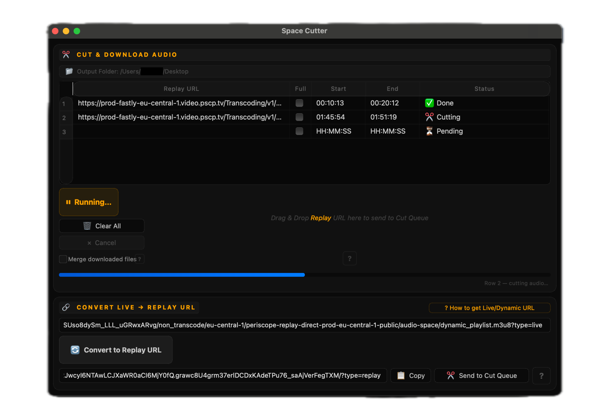

<p align="center">
  
</p>

<h1 align="center">✂️ Space Cutter</h1>

<p align="center">
  A free, standalone Mac & Windows app to cut and download audio from Twitter/X Spaces.<br/>
  No installation needed. No FFmpeg required. Just open and use.
</p>

<p align="center">
  <a href="../../releases/latest">
    
  </a>
  <a href="../../releases/latest">
    
  </a>
  <a href="../../releases/latest">
    
  </a>
</p>

<p align="center">
  
</p>

---

## ⬇️ Download the latest release

> Head to the **[Releases](../../releases/latest)** page and grab the version for your OS:
>
> 🍎 **Mac** → `SpaceCutter-Mac.zip`
> 🪟 **Windows** → `SpaceCutter-Windows.zip`

**Mac:** After unzipping, if you see a warning that the app cannot be opened:
→ **System Settings → Privacy & Security → Open Anyway**

**Windows:** After unzipping, if you see "Windows protected your PC":
1. Click **More info**
2. Click **Run anyway**

---

## Features

- Paste or drag & drop Twitter/X Space Replay URLs into the queue
- Set start and end timestamps for each clip — or check **Full** to grab the whole Space
- Type timestamps without colons — `013045` becomes `01:30:45` automatically
- Right-click any row to **paste**, **copy**, or **delete** a URL instantly
- One-click **📋 Copy** and **✂️ Send to Cut Queue** buttons on the converted Replay URL
- Download audio as `.m4a`
- Convert live Space URLs to Replay URLs automatically
- Cut multiple clips at once with live per-row status
- Merge all clips into a single continuous audio file
- Remembers your output folder across sessions
- Built-in step-by-step guidance at every stage of the workflow (EN/GR)

---

## How to Use

### 1. Find the Live/Dynamic URL

Before anything else, you need the stream URL from your browser.

```
1. Open the Twitter/X Space in your browser
2. Press F12 → go to the Network tab
3. Type "dynamic" in the filter box
4. Refresh the page or wait a moment
5. Find the request containing "dynamic_playlist.m3u8?type=live"
6. Right-click it → Copy URL
```

This is your **Live/Dynamic URL**. You'll use it in the next step.

---

### 2. Convert it to a Replay URL

Paste the Live/Dynamic URL into the bottom field and click **Convert to Replay URL**.

> Not sure where to cut yet? Paste the Replay URL into your browser and listen first — then come back and set your timestamps.

---

### 3. Add to the Cut Queue

Click **✂️ Send to Cut Queue** — or drag and drop the Replay URL directly into the drop zone.

---

### 4. Set your timestamps

Set **Start** and **End** for each clip, or check **Full** to download the entire Space.

> Tip: type timestamps without colons — `013045` becomes `01:30:45` automatically.

---

### 5. Choose output folder & start

Pick your **Output Folder**, then click **▶ Start**.

---
---

# ✂️ Space Cutter [EL]

Δωρεάν, αυτόνομο app για **Mac & Windows** για να κόβετε και να κατεβάζετε ήχο από Twitter/X Spaces.
Δεν χρειάζεται εγκατάσταση. Δεν χρειάζεται FFmpeg. Απλά ανοίξτε και χρησιμοποιήστε.

---

## ⬇️ Κατεβάστε το τελευταίο release

> Πηγαίνετε στη σελίδα **[Releases](../../releases/latest)** και κατεβάστε την έκδοση για το λειτουργικό σας:
>
> 🍎 **Mac** → `SpaceCutter-Mac.zip`
> 🪟 **Windows** → `SpaceCutter-Windows.zip`

**Mac:** Μετά το unzip, αν εμφανιστεί προειδοποίηση ότι δεν μπορεί να ανοίξει το app:
→ **System Settings → Privacy & Security → Open Anyway**

**Windows:** Μετά το unzip, αν εμφανίσει "Τα Windows προστάτευσαν τον υπολογιστή σας":
1. Πατήστε **Περισσότερες πληροφορίες**
2. Πατήστε **Εκτέλεση οπωσδήποτε**

> 😅 Μην πανικοβάλλεστε — τα Windows βγάζουν αυτό το μήνυμα για κάθε app που δεν έχει πληρώσει τη Microsoft για ένα certificate επαλήθευσης. Το SpaceCutter είναι δωρεάν εργαλείο και δεν έχει λόγο να ξοδέψει εκατοντάδες δολάρια για να εξαφανίσει ένα παράθυρο. Πατήστε "Εκτέλεση οπωσδήποτε" και προχωράμε.

---

## Χαρακτηριστικά

- Επικολλήστε ή σύρετε Twitter/X Space Replay URLs στην ουρά
- Ορίστε timestamps έναρξης και λήξης — ή τσεκάρετε **Full** για ολόκληρο το Space
- Πληκτρολογείτε timestamps χωρίς άνω-κάτω τελείες — `013045` → `01:30:45` αυτόματα
- Δεξί κλικ σε οποιαδήποτε γραμμή για **επικόλληση**, **αντιγραφή** ή **διαγραφή** URL
- Κουμπιά **📋 Copy** και **✂️ Send to Cut Queue** απευθείας στο μετατραπέν Replay URL
- Κατεβάστε τον ήχο ως `.m4a`
- Μετατρέψτε αυτόματα live Space URLs σε Replay URLs
- Κόψτε πολλά clips ταυτόχρονα με live ένδειξη κατάστασης ανά γραμμή
- Συγχωνεύστε όλα τα clips σε ένα συνεχές αρχείο ήχου
- Θυμάται τον φάκελο εξόδου μεταξύ sessions
- Ενσωματωμένες οδηγίες σε κάθε βήμα της διαδικασίας (EN/GR)

---

## Οδηγίες Χρήσης

### 1. Βρείτε το Live/Dynamic URL

```
1. Ανοίξτε το Twitter/X Space στον browser σας
2. Πατήστε F12 → πηγαίνετε στο tab Network
3. Γράψτε "dynamic" στο πεδίο φίλτρου
4. Κάντε refresh ή περιμένετε λίγο
5. Βρείτε το request που περιέχει "dynamic_playlist.m3u8?type=live"
6. Δεξί κλικ → Copy URL
```

---

### 2. Μετατρέψτε το σε Replay URL

Επικολλήστε το URL στο κάτω πεδίο και πατήστε **Convert to Replay URL**.

> Δεν ξέρετε ακόμα πού να κόψετε; Επικολλήστε το Replay URL στον browser και ακούστε πρώτα.

---

### 3. Προσθέστε στην ουρά

Πατήστε **✂️ Send to Cut Queue** — ή σύρετε το URL στη ζώνη drop.

---

### 4. Ορίστε τα timestamps

Ορίστε **Start** και **End**, ή τσεκάρετε **Full** για ολόκληρο το Space.

> Tip: `013045` → `01:30:45` αυτόματα.

---

### 5. Επιλέξτε φάκελο και ξεκινήστε

Επιλέξτε **Output Folder** και πατήστε **▶ Start**.

> Οι τελικοί χρήστες **δεν χρειάζονται Python ή FFmpeg**.
